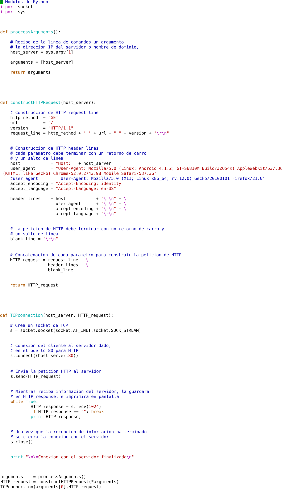
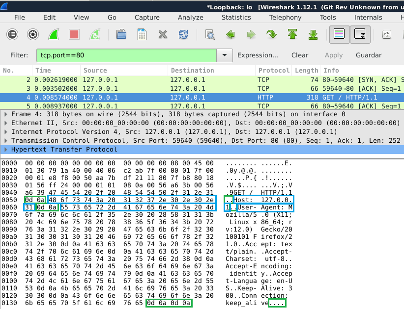
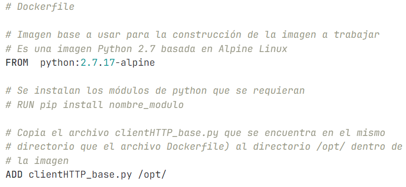
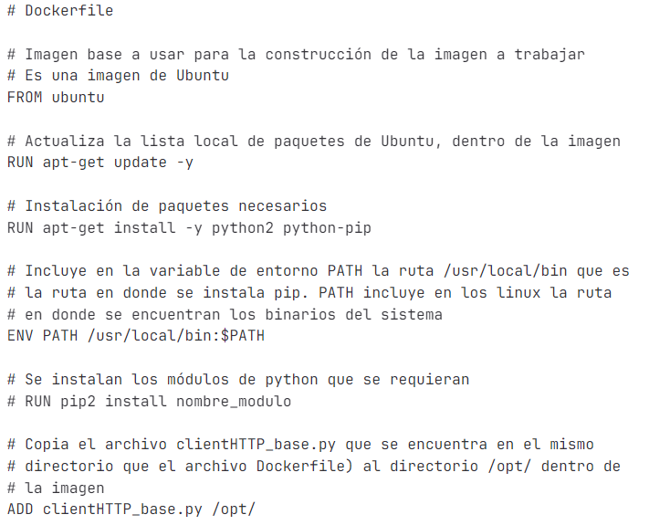

# Taller de Sistemas Operativos, Redes de Cómputo, Sistemas Distribuidos y Manejo de Información

# Práctica 4: _Programación de un cliente de HTTP y uso de contenedores_.

## Desarrollo

### Primera parte

1. Programar un cliente de HTTP versión 1.1 con el lenguaje de programación Python, se hará sin el uso de módulos complementarios como *httplib* o alguno parecido, aunque si será necesario usar otros módulos como *socket* o *sys*. El cliente podrá establecer la conexión con cualquier servidor Web usando el protocolo HTTP.

2. A continuación se muestra un código base de ejemplo escrito en Python 2, que ya no se recomienda usar por cuestiones de seguridad, en su lugar se deberá usar Python 3. Se ejecuta de la forma

 `$ python clientHTTP_base.py host`

Por ejemplo:

 `$ python clientHTTP_base.py www.fciencias.unam.mx`

3. Deberá recordar o investigar cómo se conforma la solicitud HTTP de un cliente a un servidor, al menos la solicitud enviada al servidor por el programa cliente deberá incluir los siguientes parámetros:

  * Método, URL y versión del protocolo HTTP, por ejemplo
  `GET /imagen.jpg HTTP/1.1`. Los dos primeros valores, el método y la URL, los proporcionará el usuario del programa.
  * Host, proporcionado por el usuario.
  * User-Agent, proporcionado por el usuario a partir de una lista de opciones.
  * Accept, este valor puede ser fijo
  * Accept-Charset, este valor puede ser fijo
  * Accept-Encoding, proporcionado por el usuario.
  * Accept-Language, este valor puede ser fijo
  * Connection, proporcionado por el usuario.

4. El programa final recibirá al menos seis argumentos cuando se ejecute, de la forma

`$ python clientHTTP.py host http_method url user_agent encoding connection`

en donde

  * `host`, corresponde a la dirección IP del servidor HTTP o a su nombre de dominio, por ejemplo www.fciencias.unam.mx.
  * `http_method`, corresponde al método de HTTP que se usará para enviar la solicitud al servidor, para este cliente solamente se usarán los métodos *HEAD* o *GET*.
  * `url`, corresponde al archivo o recurso solicitado al servidor web, por ejemplo */* para directorio raiz, o *imagen.jpg*.
  * `user_agent`, tendrá tres opciones numeradas del 1 al 3, cada opción corresponderá a un *user agent* diferente definido por el programador.
  * `encoding`, corresponde al parámetro de la solicitud de la codificación de la respuesta, por ejemplo *gzip*, *deflate* o *identity*.
  * `connection`, se refiere a la forma del establecimiento de la conexión, por ejemplo *keep-alive* o *close*.

 Por ejemplo:

 `$ python clientHTTP.py www.fciencias.unam.mx GET / 1 identity close`  

5. Es importante aclarar que los parámetros deben de separarse por un retorno de carro o *carriage return*, (CR) y por un salto de línea o *linefeed* (LF), y que la solicitud de HTTP debe de terminar de la misma forma con un retorno de carro y con un salto de línea. En la siguiente figura se muestra el tráfico de Wireshark en la que se observa estos delimitadores con su valor en ASCII, del lado izquierdo de la salida de los datos de Wireshark se encuentra los valores en hexadecimal de estos datos, y del lado derecho se encuentra su interpretación en código ASCII, si la interpretación no corresponde a un caracter imprimible, Wireshark colocará un punto. En los recuadros de color verde se señalan el retorno de carro y el salto de línea, en color azul los simbolos que conforman los parámetros de HTTP.

6. La respuesta HTTP enviada por el servidor deberá ser mostrada por el cliente en pantalla (en la terminal en donde se ejecutó el cliente). Puede ser sólo la respuesta HTTP en algunos casos, y en otros la respuesta HTTP junto con el archivo solicitado, ambos en pantalla. Pruebe solicitar varios recursos.

7. Incluya una función sencilla de ayuda que muestre cómo se debe de ejecutar el programa y las opciones de *User-Agent* con las que se cuenta.

8. Durante la programación del cliente se recomienda el uso de Wireshark para visualizar el tráfico de la comunicación con el servidor y así detectar posibles fallas en las solicitudes de HTTP, o en otros aspectos. Se recomienda colocar un filtro para que sólo se muestren las conexiones dirigidas al puerto 80 y a la dirección IP del servidor Web.

9. Algunos sitios web que se pueden consultar por HTTP (puerto 80), que se pueden usar para probar este cliente base:

* mail7.unam.mx
* encomunicacionct.geociencias.unam.mx
* cirrus.dcaa.unam.mx
* www.mundonano.unam.mx
* www.pued.unam.mx
* tikhonov.fciencias.unam.mx

### Segunda parte

1. Suba el código a un repositorio como GitHub o GitLab junto con la configuración para que se ejecute manualmente dentro de un contenedor de Docker, deberá incluir todas las dependencias y configuraciones necesarias. Se recomienda que el repositorio sea privado y que lo comparta a la cuenta de correo del profesor.

2. Elabore un archivo Dockerfile que tenga el nombre exacto `Dockerfile`, sin extensión, que contenga las instrucciones necesarias para la construcción de la imagen. A continuación se muestran dos ejemplos con los cuáles se crean imágenes de Docker listas para ejecutar el código base del cliente de HTTP del ejemplo `clientHTTP_base.py`.

Ejemplo para crear una imagen con sistema operativo Alpine Linux.

Ejemplo para crear una imagen con sistema operativo Ubuntu.

3. Su repositorio al menos deberá contener los archivos:
* Dockerfile
* clientHTTP.py
* README.md

4. Para probar si la construcción de la imagen es correcta siga los siguientes pasos. Instale Docker, si se está usando como sistema operativo a Debian, siga las instrucciones para instalar Docker de la documentación oficial en el siguiente enlace

https://docs.docker.com/engine/install/debian/#install-using-the-repository

5. Descargue los archivos de su repositorio, clonando el mismo.

6. Ingrese al directorio recién descargado y ejecute el siguiente comando para construir la imagen de docker:

`$ sudo docker build -t nombre_de_la_imagen:etiqueta .`

Reemplace el *nombre_de_la_imagen* con el nombre que desea darle a la imagen, y *etiqueta* con una etiqueta o versión. El punto al final del comando significa que Docker debe buscar el Dockerfile en el directorio actual. Por ejemplo:

`$ sudo docker build -t redes:p4 .`

7. Verifique que la imagen fue construida listando las imágenes con el siguiente comando:

`$ sudo docker image ls`

8. Una vez que la imagen se haya construido con éxito, ejecute un contenedor basado en la imagen recién creada con el siguiente comando, y que además le permitirá interactuar con una shell dentro del contenedor:

`$ sudo docker run --interactive --tty redes:p4 /bin/sh`

Si está usando una imagen de Ubuntu, ejecute en su lugar el siguiente comando:

`$ sudo docker run --interactive --tty redes:p4 /bin/bash`

9. Ahora ejecute el programa de python que elaboró y que copió a la imagen a través de las instrucciones del archivo Dockerfile, por ejemplo para el programa base del cliente de HTTP se ejecuta el siguiente comando:

`python2 /opt/clientHTTP_base.py www.fciencias.unam.mx`

10. Salga del contenedor con la combinación de teclas `ctrl`+`d`

## Evaluación

1. Elabore el reporte en el archivo *README.md* de su repositorio de código, indicando la forma de ejecutar su programa junto con algunos ejemplos diferentes el correcto funcionamiento de su programa. Además, incluya las respuestas a lo siguiente:

* ¿Cuál es la función de los métodos de HTTP *HEAD*, *GET*, *POST*, *PUT* y *DELETE*?
* ¿Investigue y enliste junto con su significado las categorías de códigos de estado que usa HTTP?
* ¿Para qué se usan los campos *encoding* y *connection*?

# Notas adicionales

1.  La práctica se elabora individualmente.
2.  Se pueden agregar posibles errores, complicaciones, opiniones, críticas de la práctica o del laboratorio, o cualquier comentario relativo a la práctica.
4.  Subir a Moodle en enlace a su repositorio.
